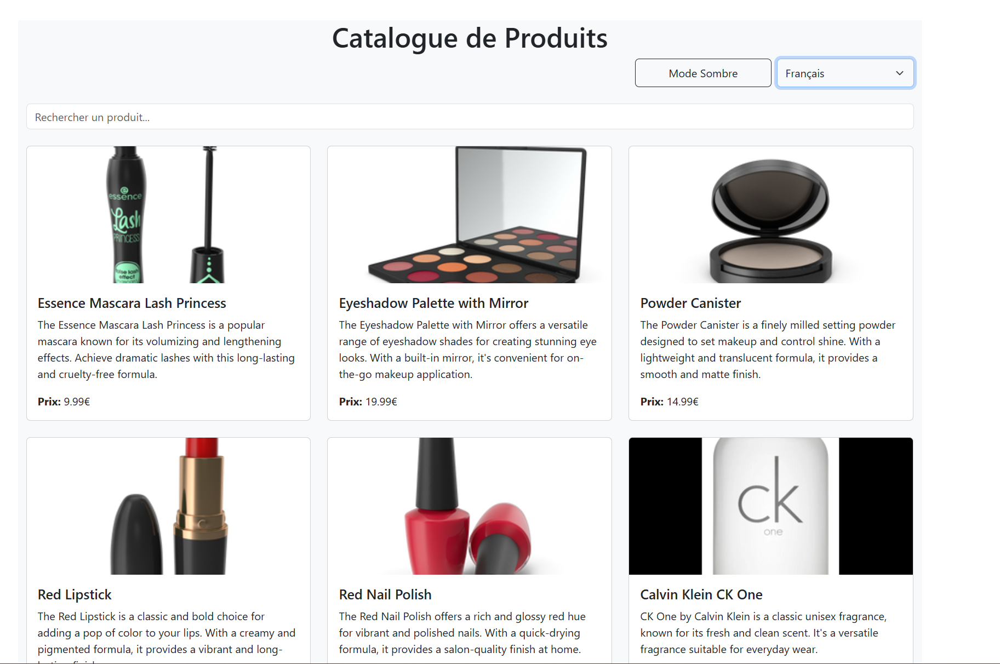

# TP React Hooks - Application de Gestion de Produits

Ce TP a pour objectif de mettre en pratique l'utilisation des Hooks React (useState, useEffect, useContext) ainsi que la création de Hooks personnalisés.

## Installation et configuration initiale

1. Cloner le dépôt :
```bash
git clone https://github.com/pr-daaif/tp-react-hooks.git
cd tp-react-hooks
```

2. Créer votre propre dépôt sur Github et changer le remote :
```bash
# Supprimer le remote origine
git remote remove origin

# Ajouter votre nouveau remote
git remote add origin https://github.com/[votre-username]/tp-react-hooks.git

# Premier push
git push -u origin main
```

3. Installer les dépendances :
```bash
npm install
```

4. Lancer l'application :
```bash
npm start
```

## Instructions pour le TP

Pour chaque exercice :
1. Lisez attentivement l'énoncé
2. Implémentez la solution
3. Testez votre implémentation (pensez à faire des copies d'écran)
4. Mettez à jour la section correspondante dans ce README avec :
   - Une brève explication de votre solution
   - Des captures d'écran montrant le fonctionnement
   - Les difficultés rencontrées et comment vous les avez résolues
5. Commitez vos changements avec un message descriptif

### Exercice 1 : Recherche en Temps Réel avec Debounce

L'objectif de cet exercice était d'implémenter une recherche en temps réel dans l'application, tout en utilisant la technique du **debounce** pour optimiser les performances et éviter de surcharger l'API avec des requêtes inutiles.

---

#### **Étapes de la Solution**

1. **Création du Hook `useDebounce` :**
   - Un hook personnalisé `useDebounce` a été créé pour retarder la mise à jour du terme de recherche. Cela permet de ne déclencher la recherche que lorsque l'utilisateur a arrêté de taper pendant 500ms.

2. **Modification du Composant `ProductSearch` :**
   - Le composant `ProductSearch` utilise maintenant le hook `useDebounce` pour obtenir une version debouncée du terme de recherche. Ce terme est ensuite envoyé au parent (`App`) pour filtrer les produits.

3. **Modification du Hook `useProductSearch` :**
   - Le hook `useProductSearch` a été modifié pour accepter un terme de recherche et filtrer les produits en conséquence. Une nouvelle requête est envoyée à l'API chaque fois que le terme de recherche change.

4. **Intégration dans `App` :**
   - Le composant `App` gère maintenant l'état du terme de recherche et le passe à `ProductList` via une prop. `ProductSearch` reçoit une fonction `onSearch` pour mettre à jour ce terme.

---

#### **Fonctionnement de la Solution**

1. **Avant la Recherche :**
   - Tous les produits sont affichés lorsque l'application est chargée.
   - Le champ de recherche est vide.

2. **Pendant la Recherche :**
   - Lorsque l'utilisateur commence à taper, le terme de recherche est debouncé.
   - Aucune requête n'est envoyée tant que l'utilisateur n'a pas arrêté de taper pendant 500ms.

3. **Après la Recherche :**
   - Une fois le délai de debounce écoulé, une requête est envoyée à l'API pour récupérer les produits correspondants.

---

#### **Captures d'Écran**
1. **Avant la Recherche :**
   


2. **Après la Recherche :**
   

---

### Exercice 2 : Gestion des Préférences de Langue

L'objectif était d'implémenter un système de gestion de langue avec React Context.

---

#### **Étapes de la Solution**

1. **Création du `LanguageContext` :**
   - Un contexte pour stocker la langue actuelle et la fonction de mise à jour.

2. **Ajout du Sélecteur de Langue :**
   - Un composant `LanguageSelector` permet de choisir entre français et anglais.

3. **Utilisation du Contexte :**
   - Les composants utilisent la langue sélectionnée pour afficher les textes traduits.

---

#### **Fonctionnement**

1. **Sélecteur de Langue :**
   - L'utilisateur choisit une langue, et le contexte est mis à jour.

2. **Affichage des Textes :**
   - Les textes sont dynamiquement traduits en fonction de la langue sélectionnée.

---

#### **Captures d'Écran**

1. **Sélecteur de Langue :**
   

2. **Application en Français :**
   

3. **Application en Anglais :**
   

---

### Exercice 3 : Hooks Personnalisés
#### Objectif : Créer des hooks réutilisables

- [ ] 3.1 Créer le hook useDebounce
- [ ] 3.2 Créer le hook useLocalStorage
- [ ] 3.3 Documenter votre solution ici

_Votre réponse pour l'exercice 3 :_
```
Expliquez votre solution ici
[Ajoutez vos captures d'écran]
```

### Exercice 4 : Gestion Asynchrone et Pagination
#### Objectif : Gérer le chargement et la pagination

- [ ] 4.1 Ajouter le bouton de rechargement
- [ ] 4.2 Implémenter la pagination
- [ ] 4.3 Documenter votre solution ici

_Votre réponse pour l'exercice 4 :_
```
Expliquez votre solution ici
[Ajoutez vos captures d'écran]
```

## Rendu

- Ajoutez l'URL de votre dépôt Github dans  **Classroom** et envoyer la réponse dès le démarage de votre projet.
- Les push doivent se faire au fûr et à mesure que vous avancez dans votre projet.
- Le README.md doit être à jour avec vos réponses et captures d'écran. 
- Chaques exercice doit faire l'objet d'au moins un commit avec un message mentionnant le numéro de l'exercice.